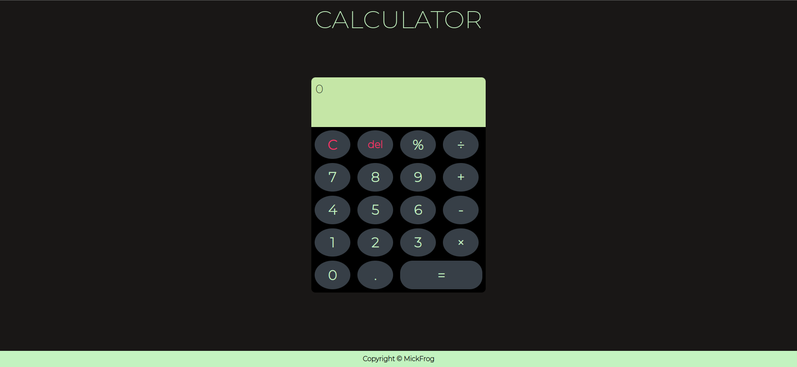
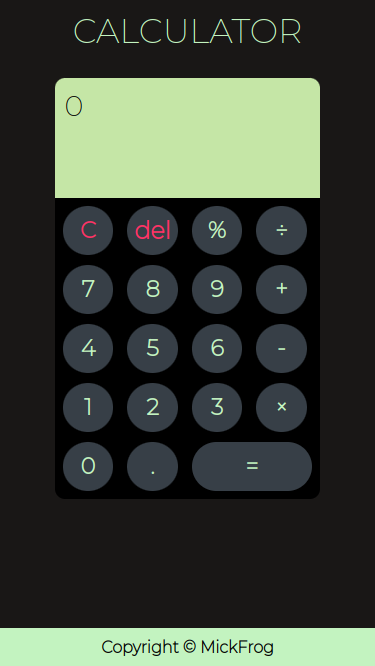

# calculator

This is the final project in The Odin Project(TOP) foundations section.
It aims to create a simple calculator with basic + - \ \* functions using Javascript.

## Demo

The calculator project can be viewed live [here](https://mickfrog.github.io/calculator)

## Preview

## Built with

- HTML
- CSS
- JavaScript

[MickFrog](https://www.github.com/MickFrog)
